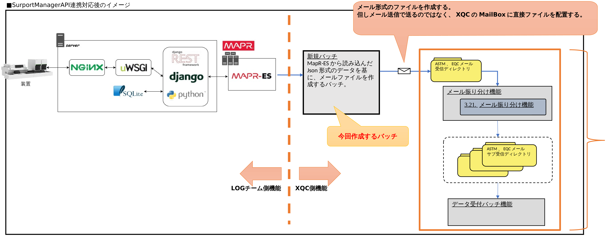

# five_sheet_

## 概要 (Sheet Data)

▼XQC_SurportManagerAPI連携対応  
【概要】  
LOGチーム側で管理しているSurportManagerAPIの動きが変更となる。  
現状は受信データからメールファイルを作成し、SMTPサーバー経由でメールとして送信している。  
ここの動きをメール送信ではなくMapR-ES（Stream形式）を介してXQC側に連携する動きに変更する。  
XQCシステムとしてはMapR-ESからデータを読み取り、現在のXQCのメール振り分けやデータ受付機能への連携をする為の新規バッチを製造する。  
【本資料の構成】  
シート毎に下記内容について検討した内容を記載する。  
① XQC側で作成するバッチのイメージ  
② バッチ処理概要  
③ 例外処理検討  
④ 常駐プロセス方法の検討  
⑤ 性能検証案  
## XQC側で作成するバッチのイメージ (Sheet Data)

▼XQC側で作成するバッチのイメージ  
■現状のXQCシステムの入り口部分  

■SurportManagerAPI連携対応後のイメージ  

MailBoxより先の処理は  
既存処理から変更なしとする。  
LOGチーム側機能 XQC側機能  